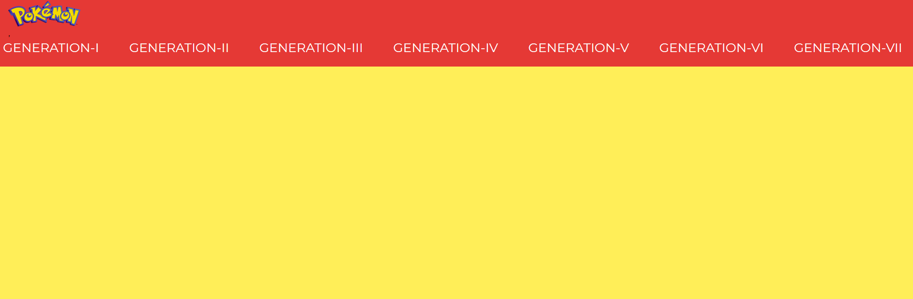
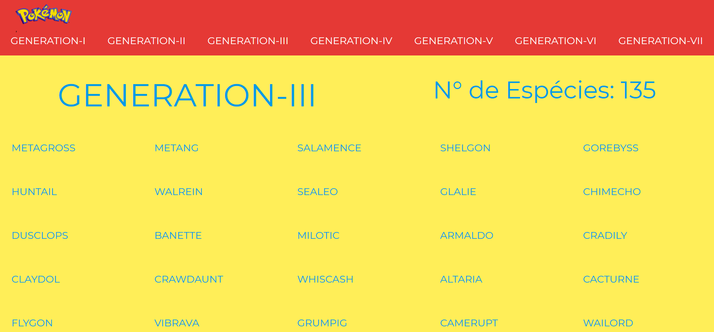
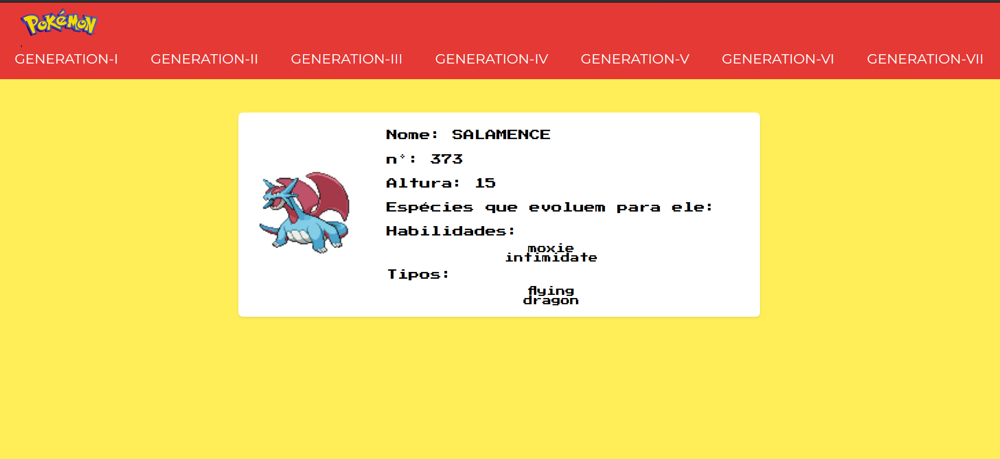

# pokeAPI
Através da API do Pokemon foi criado um site que lista as gerações dos games e suas respectivas características.

#Iniciando
Clone o projeto em sua máquina e use os comandos abaixo para incializá-lo:

  npm install
  npm start
  
#Navegação

Ao entrar no site, todas as gerações de games são listadas no cabeçalho.

Clicando em qualquer uma das gerações é listado todas as espécies que foram inseridas naquela geração e em cima mostra o total delas.

Ao clicar no nome de uma das espécies é carregado uma página com os detalhes do Pokemon escolhido.

